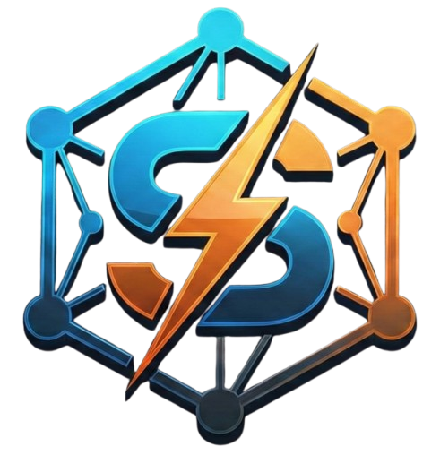
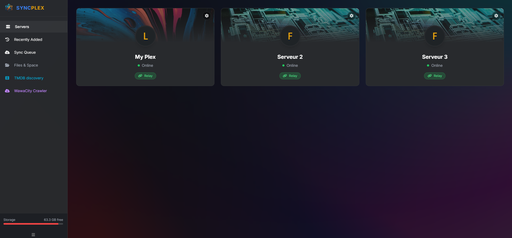

<p align="center"></p>

# ⚡ SYNCPLEX


**SYNCPLEX** is a streamlined, self-hosted web application designed to browse, search, and download media from any Plex server shared with you.


<p align="center"></p>


## ✨ Features

* **🔍 Advanced Browsing:** 
    * Support for Movies and TV Shows.
    * Drill down into Seasons and Episodes.
    * Real-time search across libraries.
* **📊 Technical Metadata:** 
    * View file resolution (4K, 1080p, etc.) and file size directly on media thumbnails.
* **⚙️ Download:**
    * Movies are automatically saved to `/downloads/movies`.
    * TV Shows/Episodes are saved to `/downloads/tvshows`.
* **⏳ Robust Queue Management:** 
    * Sequential downloading to prevent network bottleneck.
    * Pause, Resume, and Clear queue controls.
    * Automatic retries on connection drops.
* **💻 Hybrid Downloading:**
    * **Server Download:** Save files directly to your NAS/Server storage.
    * **Direct Download:** One-click button to download files directly to your PC/Browser.
* **🔌 Connection Manager:** Manually select specific server IP/Ports to bypass SSL issues or Plex Relay speed caps.

---

## 🚀 Installation

### Prerequisites
* **Docker** and **Docker Compose** installed.
* A **Plex Account** (Username/Password or X-Plex-Token).

### 1. Setup Environment
Create a `.env` file in the project root:
```ini
# Recommended: Find your token in Plex Web (Browser)
PLEX_TOKEN=your_plex_token_here

# Alternative (Required if Token is not provided)
PLEX_USER=your_email@example.com
PLEX_PASSWORD=your_password

# Optionnal
# You can add your TMDB key for Discovery feature
TMDB_API_KEY=your_tmdb_key

# Optionnal
# You can add wawacity base URL for movies discovery
WAWA_URL=https://www.wawacity.irish

```

### 2. Deploy with docker-compose.yml
Ensure your docker-compose.yml is configured as follows:


```yaml
services:
  syncplex:
    image: emeryn/syncplex:v1.0
    ports:
      - "8000:8000"
    volumes:
      - ./downloads:/downloads  
      #  Or if you want to bind your plex folders directly
      #- /data/plex/movies/:/downloads/movies
      #- /data/plex/tvshows/:/downloads/tvshows
    env_file: .env
    restart: unless-stopped
```

Run the command: 

```bash
docker-compose up -d 
```


## 📖 How to Use
1. **Access**: Go to http://YOUR_SERVER_IP:8000.
2. **Browse**: Click on any shared server to see available libraries.
3. **Search**: Use the top-right search bar within any library.
4. **Select**: * Click posters to select multiple items for Server Download.
5. Click the Hard Drive icon (bottom right of poster) for Immediate PC Download.
6. **Queue**: Monitor your progress in the Activity tab. You can pause the queue if you need to reclaim bandwidth.


## 🔑 How to find your X-Plex-Token

Using an **X-Plex-Token** is the most secure and stable way to connect **SYNCPLEX**. It allows the app to authenticate without needing to store your actual password.

---

### The "View XML" Method (Easiest)

1. **Sign in** to your Plex Web app at [app.plex.tv](https://app.plex.tv).
2. **Select any movie or episode** from your library to open its details page.
3. Click the **three dots (...)** (More) button in the toolbar.
4. Select **"Get Info"** at the bottom of the list.


5. A popup will appear showing file details. In the bottom-left corner, click the blue **"View XML"** link.

---

### Extracting the Token from the URL

A new browser tab will open filled with code. **You don't need to read the code.** Simply look at your browser's **Address Bar (URL)**:

1. Go to the very end of the URL.
2. Look for the parameter `X-Plex-Token=`.
3. Your token is the string of letters and numbers immediately following the `=` sign.

> **Example:**
> `https://192-168-1-10.plex.direct:32400/library/metadata/1?X-Plex-Token=`**`AbC1dE2fG3hI4jK5lM6n`**


---

### 🛡️ Security Warning

* **Copy and paste** this token into your `.env` file as the value for `PLEX_TOKEN`.
* **Never share your token.** It grants full access to your Plex account without a password. 
* If you think your token has been compromised, **changing your Plex password** will invalidate all existing tokens and generate new ones.
* Only use for your own Plex or educational purpose
* **DO NOT INSTALL** this service on public VPSs or cloud providers. Your Plex token will be exposed 


## 📚 API & Documentation

SYNCPLEX exposes a REST API documented automatically via Swagger UI.

Accessing the Documentation
Once the container is running, open your browser to the following address to explore and test the endpoints:

```txt
http://SYNCPLEX_URI/docs
```

