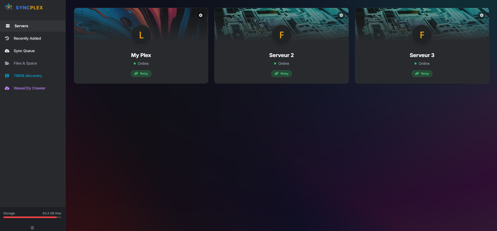

<p align="center"></p>

# ⚡ SYNCPLEX

**SYNCPLEX** is a self-hosted web app to browse, search and download media from every Plex server shared with you, so friends can keep their libraries in sync.

<p align="center"></p>

## ✨ Features

* **🔐 Sign in with Plex:** Official Plex login (same flow as Plex apps). No password or token in config files, and each user browses with their own account.
* **🔍 Browsing:**
    * Movies and TV shows, with drill-down into shows → seasons → episodes.
    * Infinite scrolling, sorting (date added, title, year, release date, rating) and title filter per library.
    * **Search all servers at once**, plus a merged "Recently Added" feed.
    * Details: summary, cast, genres, audio and subtitle languages, codecs, file name, plus a "Watch on Plex" link.
* **☁️ Server sync queue:**
    * Sync a movie, an episode, a whole season or a whole show in one click.
    * Movies go to `/downloads/movies`, episodes to `/downloads/tvshows/<Show>/Season XX/` (Plex naming).
    * Resumable downloads (`.part` files + HTTP Range), automatic retries, pause/resume, cancel, speed and ETA.
    * Files already on disk are skipped.
* **💻 Download to this device:** fetch the original file straight from the Plex server in your browser.
* **🗂️ Files & storage:** browse, sort and delete files in the download folder, with disk usage.
* **🔌 Connection manager:** connections are probed automatically (direct first, relay last); you can pin a specific address to bypass relay speed caps.

---

## 🚀 Installation

### Prerequisites
* **Docker** and **Docker Compose**.
* A **Plex account** with access to at least one server.

### 1. Configure (optional)
Create a `.env` file next to `docker-compose.yml` (see `.env.example`):

```ini
# Only these Plex accounts can sign in (usernames or emails, comma-separated).
# Empty = any Plex account can sign in.
ALLOWED_USERS=me@example.com,my_friend

# Files downloaded in parallel by the server queue
MAX_CONCURRENT_DOWNLOADS=1
```

> ⚠️ Set `ALLOWED_USERS` whenever the app is reachable by other people: anyone who signs in can fill or delete files in the download folder.

### 2. Deploy

```yaml
services:
  syncplex:
    image: emeryn/syncplex:latest
    ports:
      - "8000:8000"
    volumes:
      - ./config:/config        # sessions and Plex client identifier
      - ./downloads:/downloads
      # Or bind your Plex folders directly:
      #- /data/plex/movies/:/downloads/movies
      #- /data/plex/tvshows/:/downloads/tvshows
    env_file: .env
    restart: unless-stopped
```

```bash
docker compose up -d
```

### 3. Sign in
Open `http://YOUR_SERVER_IP:8000` and click **Sign in with Plex**. A Plex window opens; approve access and you are in.

---

## 📖 How to use
1. **Servers:** pick a server, then a library. The ⚙️ button lets you choose the connection.
2. **Select:** click posters to select several items, then hit **Sync to server** at the bottom.
3. **Hover a poster** for quick actions: open (shows/seasons), details, sync to server, download to this device.
4. **Sync Queue:** follow progress, pause the queue to free bandwidth (downloads resume where they stopped), retry failures.
5. **Files & Storage:** clean up the download folder.

## ⚙️ Environment variables

| Variable | Default | Description |
|---|---|---|
| `ALLOWED_USERS` | *(empty)* | Plex usernames/emails allowed to sign in. Empty = everyone. |
| `MAX_CONCURRENT_DOWNLOADS` | `1` | Parallel downloads in the server queue. |
| `SESSION_TTL_DAYS` | `30` | How long a sign-in lasts. |
| `DATA_DIR` | `/config` | Where sessions and the client identifier are stored. |
| `DOWNLOAD_DIR` | `/downloads` | Download destination. |

## 🛡️ Security
* Plex tokens stay on the server: the browser only gets an opaque, HttpOnly session cookie, and posters go through a proxy.
* Sessions are stored in `/config/sessions.json`; keep this folder private. Delete it to sign everyone out.
* Signing out of SyncPlex does not revoke the Plex authorization. You can revoke it in Plex under *Settings → Authorized Devices*.
* Put SyncPlex behind HTTPS (reverse proxy) if it is exposed outside your network.
* Only use it with content you are allowed to copy.

## 🧑‍💻 Local development

```bash
pip install -r requirements.txt
cd app
DATA_DIR=../config DOWNLOAD_DIR=../downloads uvicorn main:app --reload
```

## 📚 API
The REST API is documented with Swagger UI at `http://SYNCPLEX_URL/docs` (sign in first, the API uses the session cookie).
